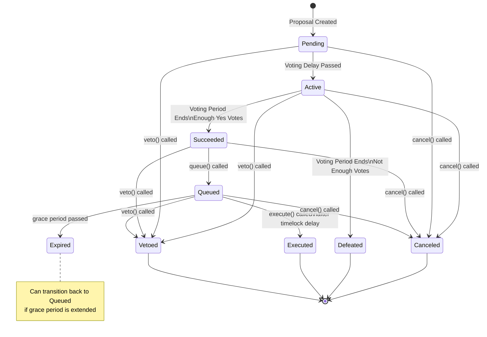

A State Transition Map is like a roadmap showing all the possible states an object (in this case, a proposal) can be in and how it moves between those states. Think of it as tracking the lifecycle of something in your system.

**Best practices for creating these maps include:**
- Use clear, consistent notation
- Show all conditions affecting transitions
- Include timing conditions and parameters
- Note any governance-controlled variables
- Mark truly final states clearly
- Document assumptions about state permanence
- Consider external factors that could affect states

[Discuss with Claude AI](https://claude.ai/chat/d16e4ae0-9abb-4133-8c67-63bdaf39ffee)

Let's create a State Transition Map for the [[2023-07-nounsdao#[M-03] `NounsDAOV3Proposals.cancel()` should allow to cancel the proposal of the Expired state]] system as an example. Here's how to do it step by step:

1. First, identify all possible states by reading through the code. In NounsDAO, a proposal can be in these states:
	- Pending
	- Active
	- Succeeded
	- Defeated
	- Queued
	- Executed
	- Canceled
	- Vetoed
	- Expired
2. For each state, identify what triggers transitions to other states. Look at functions that change state and their conditions. For example:
	- Pending → Active: When voting delay period passes
	- Active → Succeeded: When voting period ends with enough 'yes' votes
	- Active → Defeated: When voting period ends without enough votes
	- Succeeded → Queued: When queue() function is called
	- Queued → Executed: When execute() function is called after timelock delay
	- Queued → Expired: When grace period passes without execution
3. Document any special conditions or parameters that affect transitions. In our case:
	- Timelock delay affects when Queued proposals can be Executed
	- Grace period affects when Queued proposals become Expired
	- Voting thresholds affect transition from Active to Succeeded/Defeated
4. Review the map for potential issues:
	- Look for states that should be final but have escape routes
	- Check for circular transitions that could create loops
	- Examine conditions that could change (like grace period)
	- Consider what happens if multiple transitions are possible
5. Question assumptions about state finality:
	- Are "final" states truly final?
	- What parameters could affect state transitions?
	- Could governance changes impact state behavior?

In the NounsDAO case, this analysis would reveal that the Expired state isn't truly final because the grace period parameter can change. This is exactly the vulnerability that was found.

## Examples
- [[2023-07-nounsdao#[M-03] `NounsDAOV3Proposals.cancel()` should allow to cancel the proposal of the Expired state]]
- [[2023-09-PoolTogether#[H-01] Too many rewards are distributed when a draw is closed]]